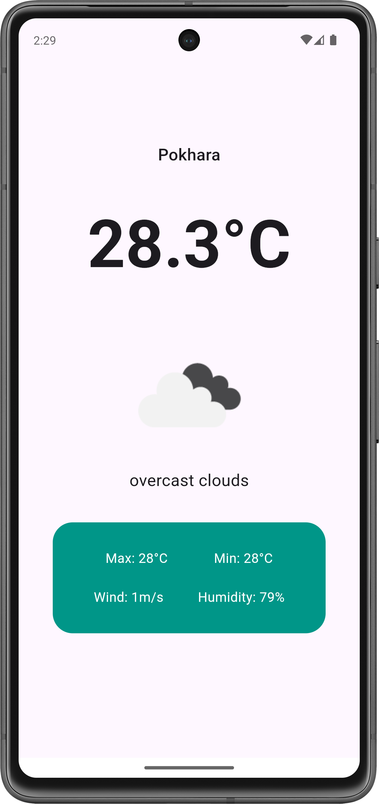

# Introduction

Forecasts is a very simple flutter project made in Flutter. It is an app for weather forecasts.

## Dependencies

This app depends on the following pub.dev packages:

- [weather](https://pub.dev/packages/weather)
- [intl](https://pub.dev/packages/intl)

For the weather api, this app makes use of [OpenWeather](https://openweathermap.org)

## References

https://hussainmustafa.com/tutorials-source-code/#flutter_weather_app_tutorial